#  GitOps-Based Kubernetes Application Deployment using ArgoCD (EKS)

---

##  Project Overview
This project demonstrates a **GitOps workflow** using ArgoCD on AWS EKS where all deployments are managed through Git.

-  No manual `kubectl apply`
-  Fully automated deployment using ArgoCD

---

##  Architecture


Developer → GitHub → ArgoCD → EKS Cluster → Kubernetes


---

##  Tech Stack
- Docker
- Kubernetes (EKS)
- ArgoCD
- GitHub
- AWS EC2

---

##  Infrastructure Setup

###  EC2 Instance
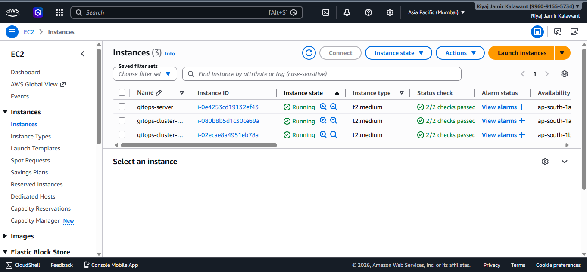

###  EKS Cluster
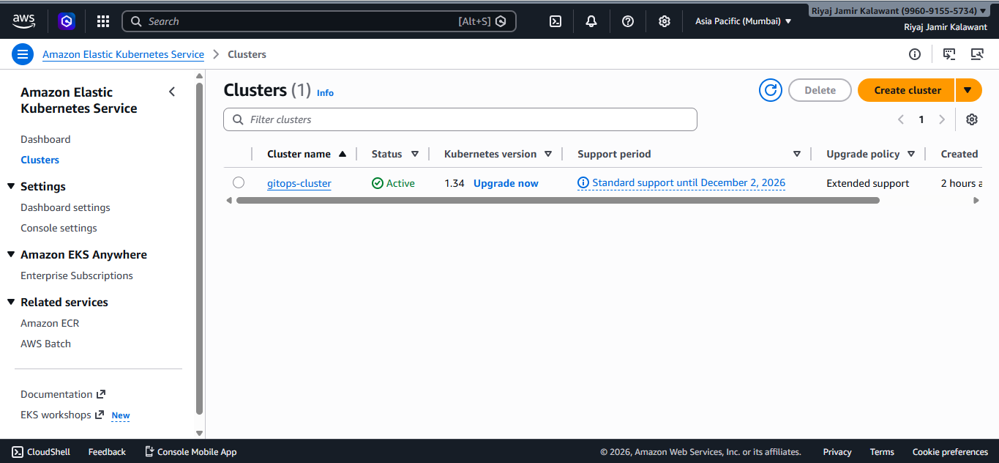

---

##  Docker Image

### DockerHub Repository
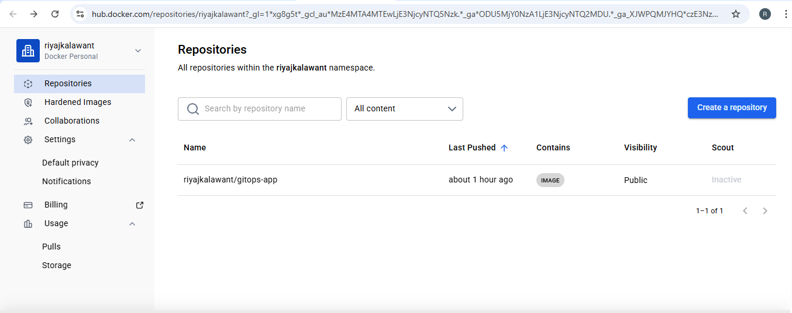

---

##  GitHub Repository
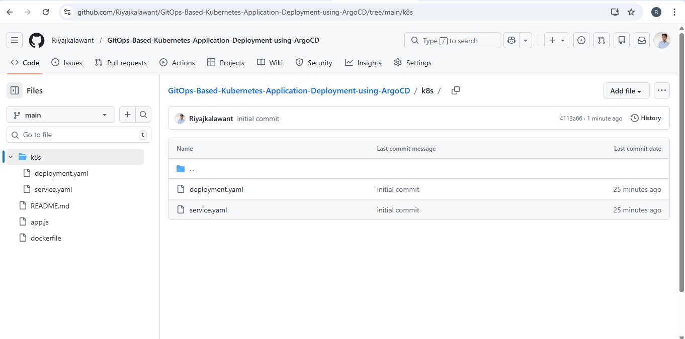

---

##  ArgoCD Setup

### ArgoCD Dashboard
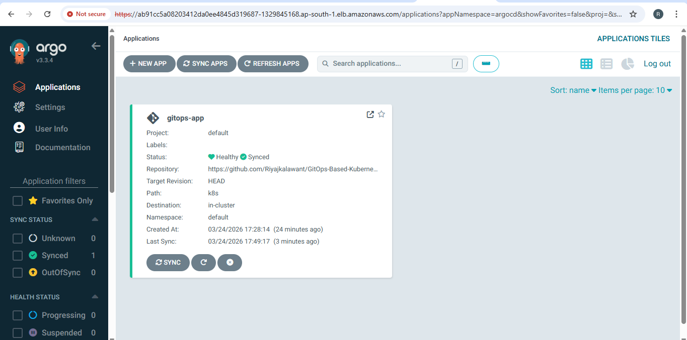

### Auto Sync Enabled
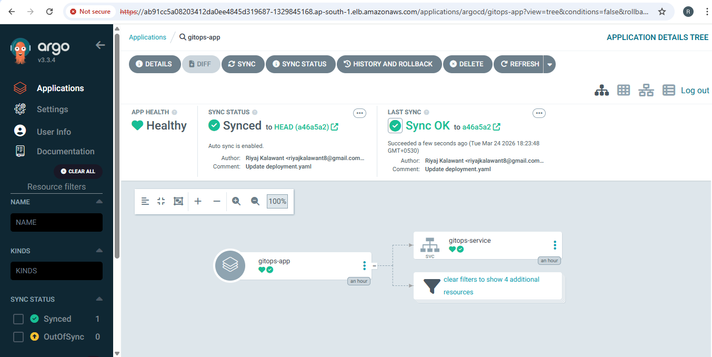

### Sync Details
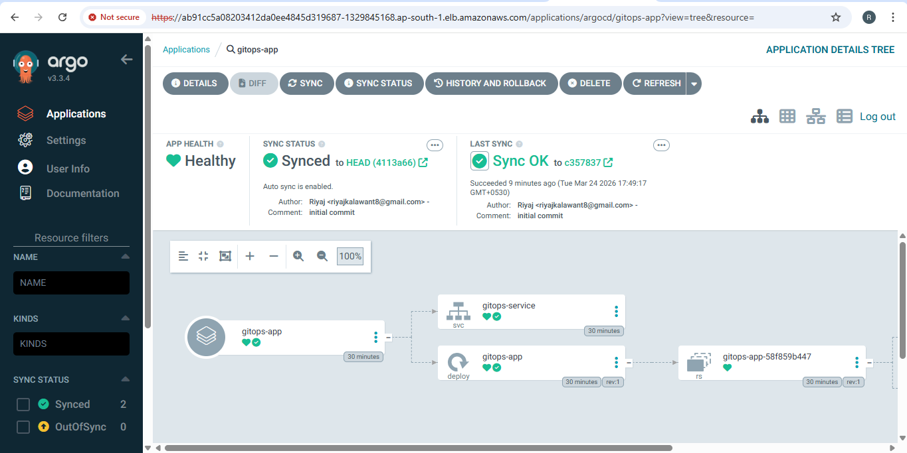

---

##  Kubernetes Resources

### Pods Running
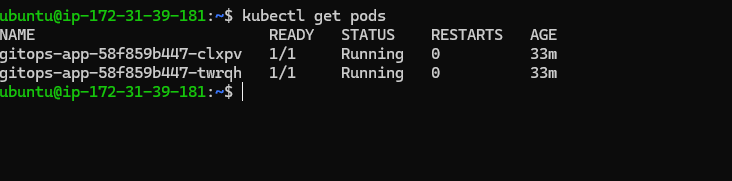

### Service (LoadBalancer)
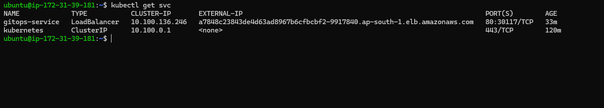

---

##  Application Output

### Initial Version (v1)
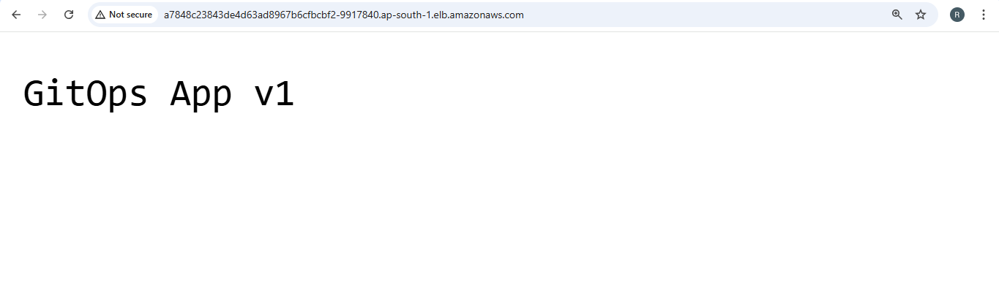

---

##  GitOps Working Proof

### Code Change (GitHub Commit)


### Updated Output (v2)
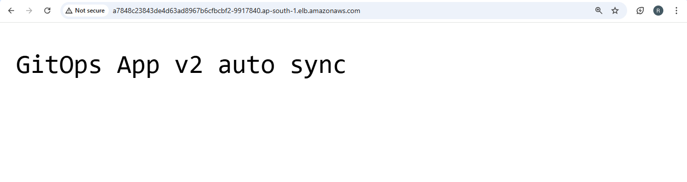

---

##  GitOps Workflow
1. Developer updates code
2. Pushes changes to GitHub
3. ArgoCD detects changes automatically
4. Syncs application with Kubernetes
5. Updated version deployed without manual intervention

---

##  Commands Used

```bash
# Build Docker Image
docker build -t riyajkalawant/gitops-app:v1 .

# Push Image
docker push riyajkalawant/gitops-app:v1

# Check Pods
kubectl get pods

# Check Services
kubectl get svc
```
 #### Key Features
 GitOps-based deployment
 Automated sync using ArgoCD
 Self-healing enabled
 Scalable Kubernetes deployment
 No manual cluster changes
#### Learnings
Importance of Git as source of truth
ArgoCD automation and sync
Kubernetes YAML structure Debugging deployment issues
 #### Conclusion

Successfully implemented a production-style GitOps pipeline using ArgoCD and AWS EKS with automated deployments.
#### Author

Riyaj Kalawant